# Obtura Architecture Diagrams

## Overall System Architecture

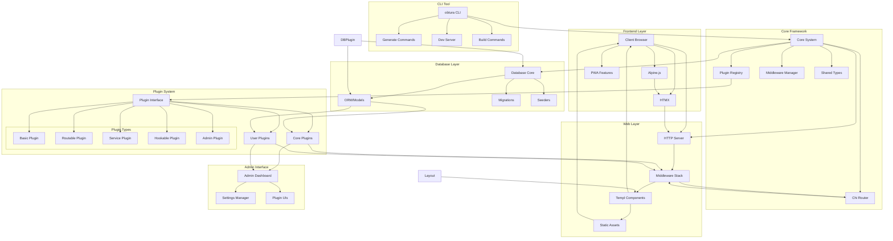

## Plugin Architecture

```mermaid
graph LR
    subgraph "Plugin Interface"
        Interface[Plugin]
        Interface --> ID[ID()]
        Interface --> Name[Name()]
        Interface --> Version[Version()]
        Interface --> Initialize[Initialize()]
        Interface --> Start[Start()]
        Interface --> Stop[Stop()]
        Interface --> Config[Config()]
    end

    subgraph "Plugin Types"
        RoutablePlugin[RoutablePlugin]
        RoutablePlugin --> Routes[Routes()]
        
        ServicePlugin[ServicePlugin]
        ServicePlugin --> Service[Service()]
        
        HookablePlugin[HookablePlugin]
        HookablePlugin --> Hooks[Hooks()]
        
        AdminPlugin[AdminPlugin]
        AdminPlugin --> AdminRoutes[AdminRoutes()]
    end

    subgraph "Core Plugins"
        Auth[Auth Plugin]
        Docs[Documentation Plugin]
        Hello[Hello Plugin]
        Analytics[Analytics Plugin]
        SEO[SEO Plugin]
        Cache[Cache Plugin]
    end

    subgraph "Plugin Lifecycle"
        Register[Register Plugin]
        Init[Initialize]
        StartP[Start Plugin]
        Running[Running State]
        StopP[Stop Plugin]
        
        Register --> Init
        Init --> StartP
        StartP --> Running
        Running --> StopP
    end

    Interface --> RoutablePlugin
    Interface --> ServicePlugin
    Interface --> HookablePlugin
    Interface --> AdminPlugin
    
    Interface --> Auth
    Interface --> Docs
    Interface --> Hello
```

## Request Flow

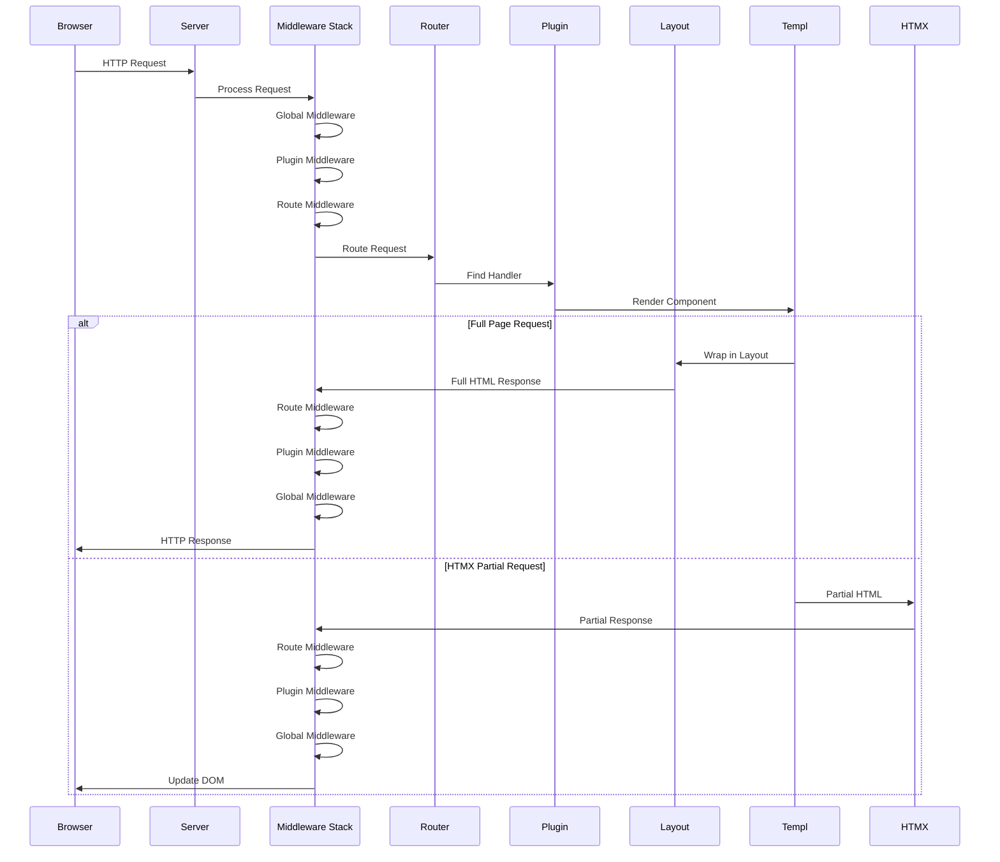

## Development Workflow

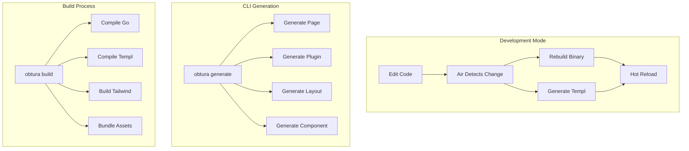

## Layout System

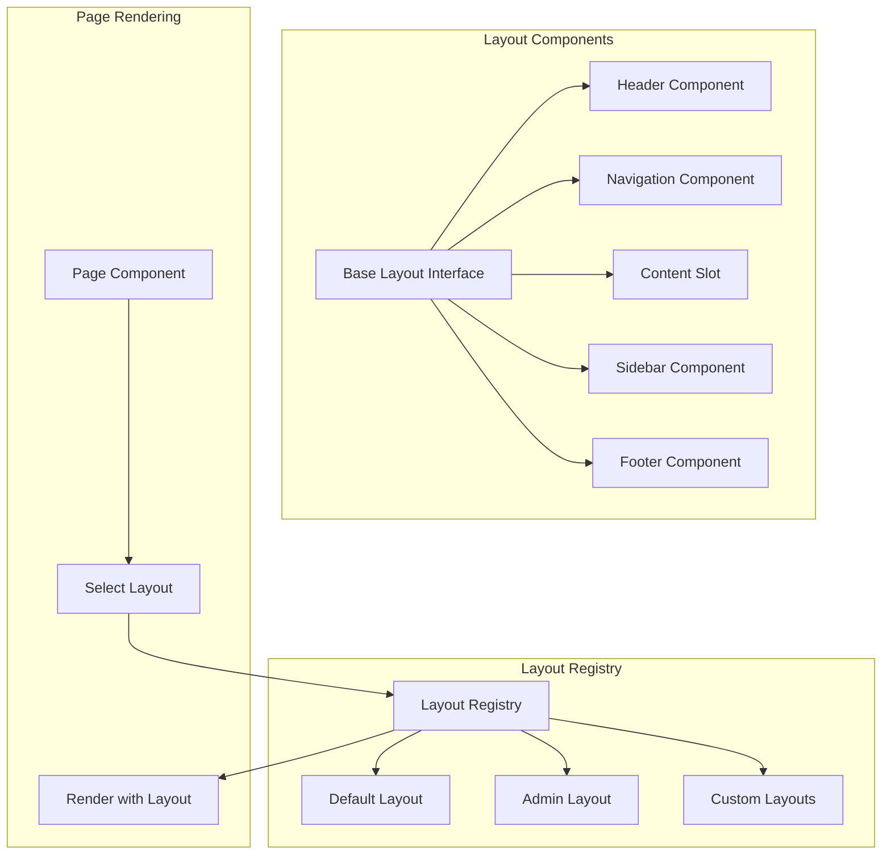

## Navigation System

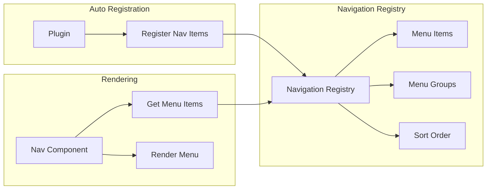

## Themes Plugin Architecture

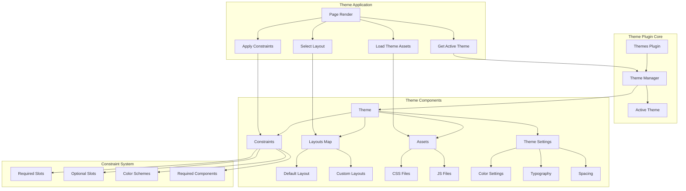

## Middleware Architecture

```mermaid
graph TB
    subgraph "Middleware Stack"
        Request[HTTP Request]
        MW1[Logger Middleware]
        MW2[Auth Middleware]
        MW3[CORS Middleware]
        MW4[Rate Limiter]
        MW5[Plugin Middleware]
        Handler[Route Handler]
        Response[HTTP Response]
        
        Request --> MW1
        MW1 --> MW2
        MW2 --> MW3
        MW3 --> MW4
        MW4 --> MW5
        MW5 --> Handler
        Handler --> Response
    end

    subgraph "Middleware Registry"
        Registry[Middleware Registry]
        Global[Global Middleware]
        Route[Route Middleware]
        Plugin[Plugin Middleware]
        
        Registry --> Global
        Registry --> Route
        Registry --> Plugin
    end

    subgraph "Middleware Interface"
        Interface[IMiddleware]
        Process[Process(next Handler)]
        Priority[Priority()]
        Name[Name()]
        
        Interface --> Process
        Interface --> Priority
        Interface --> Name
    end

    subgraph "Plugin Integration"
        PluginReg[Plugin Registration]
        PluginReg --> RegisterMW[Register Middleware]
        RegisterMW --> Registry
    end
```

## Middleware Types and Flow

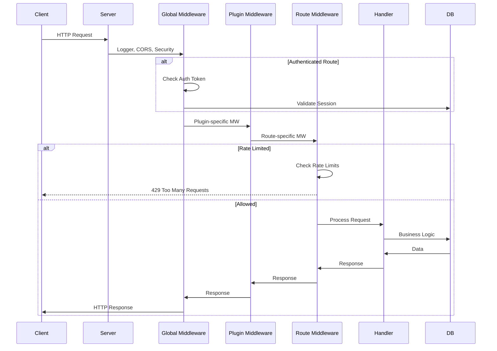

## Frontend Architecture

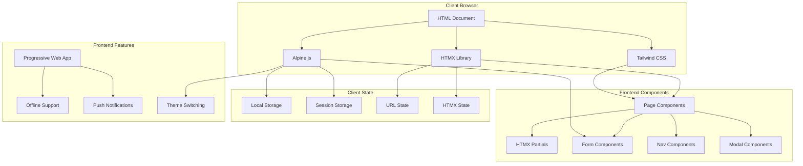

## Frontend-Backend Interaction

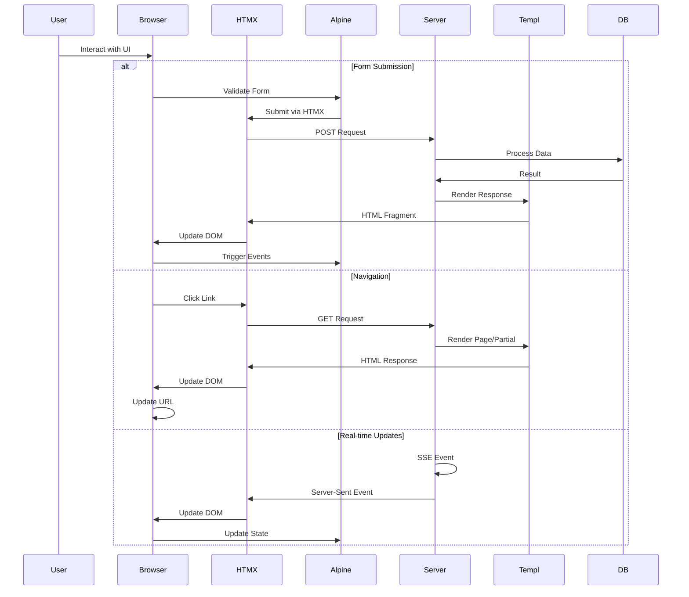

## Client-Side Component Architecture

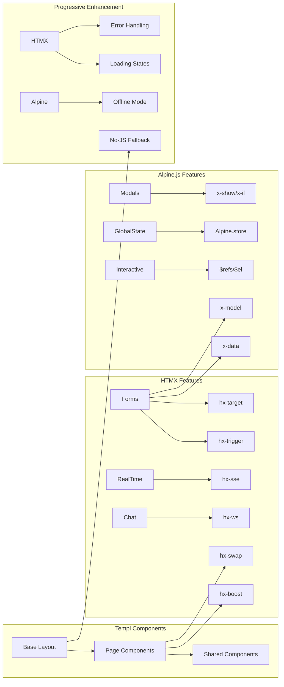

## Database Architecture

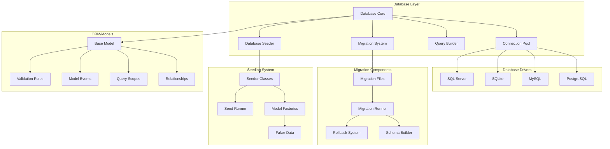

## MVC Architecture Pattern

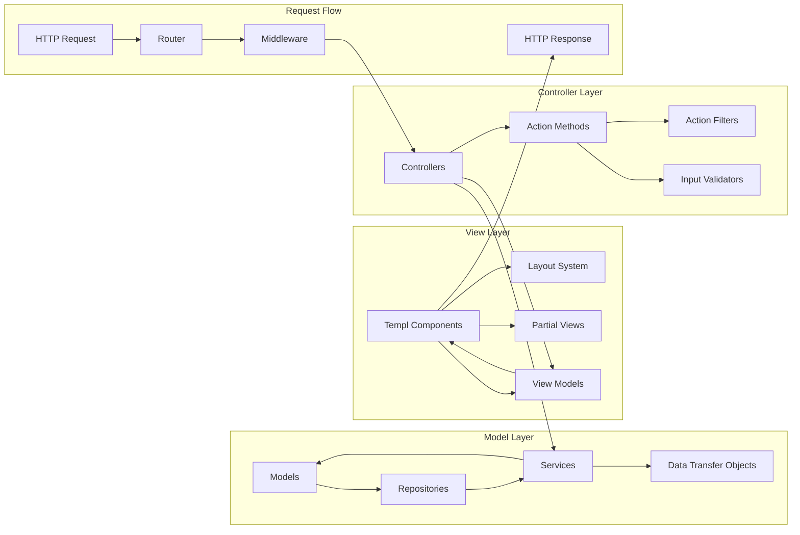

## Database Migration Flow

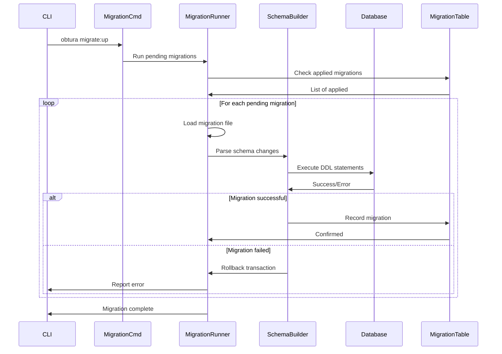

## Database Seeding Flow

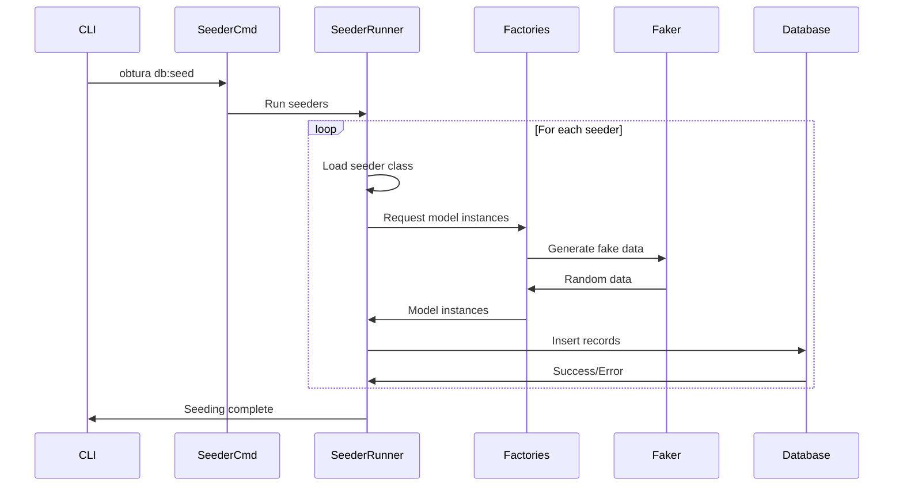

## Model Lifecycle and Events

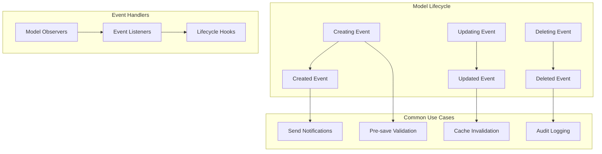

## Theme Switching Flow

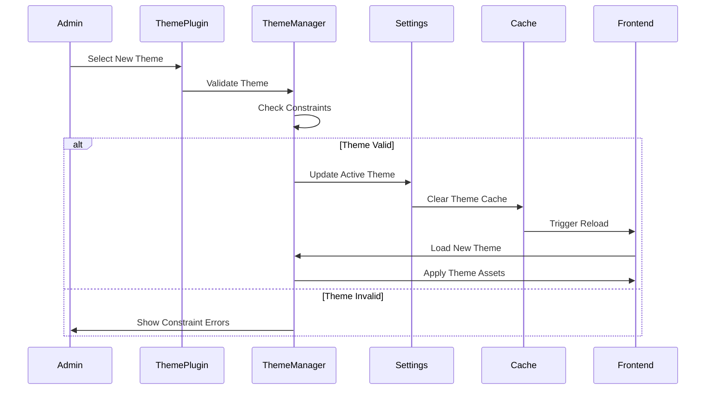

## Documentation Plugin Architecture

```mermaid
graph TB
    subgraph "Documentation Plugin"
        DocsPlugin[Docs Plugin]
        Scanner[Package Scanner]
        Parser[Go AST Parser]
        Generator[Doc Generator]
        Search[Search Engine]
        
        DocsPlugin --> Scanner
        Scanner --> Parser
        Parser --> Generator
        Generator --> Search
    end

    subgraph "Documentation Sources"
        GoFiles[Go Source Files]
        Comments[Doc Comments]
        Packages[Package Structure]
        
        GoFiles --> Comments
        GoFiles --> Packages
    end

    subgraph "Documentation Types"
        PackageDocs[Package Docs]
        TypeDocs[Type Documentation]
        FunctionDocs[Function Docs]
        MethodDocs[Method Docs]
        
        PackageDocs --> TypeDocs
        TypeDocs --> MethodDocs
        PackageDocs --> FunctionDocs
    end

    subgraph "Output Routes"
        DocsIndex[/docs - Index Page]
        APIRef[/docs/api - API Reference]
        PackageView[/docs/api/{package}]
        SearchAPI[/docs/search]
        AdminDocs[/admin/docs]
    end

    Scanner --> GoFiles
    Parser --> Comments
    Generator --> PackageDocs
    DocsPlugin --> DocsIndex
    DocsPlugin --> APIRef
    DocsPlugin --> PackageView
    DocsPlugin --> SearchAPI
    DocsPlugin --> AdminDocs
```

## Documentation Generation Flow

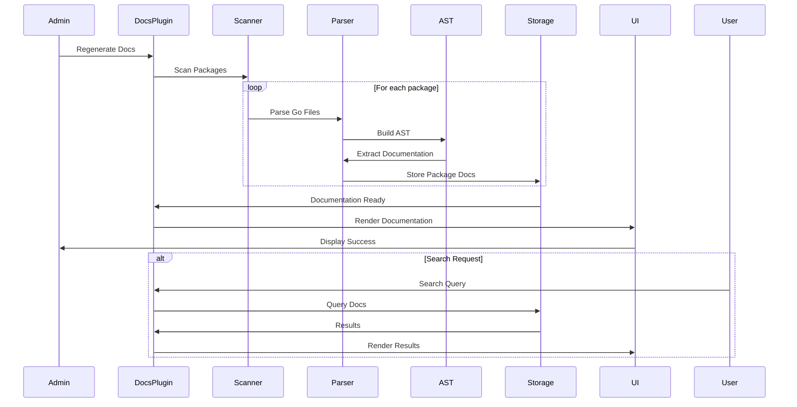

## Plugin Registry Architecture

```mermaid
graph TB
    subgraph "Plugin Registry"
        Registry[Registry Core]
        PluginMap[Plugin Map]
        ServiceMap[Service Map]
        HookMap[Hook Map]
        RouteQueue[Route Queue]
        
        Registry --> PluginMap
        Registry --> ServiceMap
        Registry --> HookMap
        Registry --> RouteQueue
    end

    subgraph "Registry Methods"
        Register[Register()]
        Get[Get()]
        List[List()]
        GetService[GetService()]
        TriggerHook[TriggerHook()]
        SetRouter[SetRouter()]
        
        Register --> PluginMap
        Get --> PluginMap
        GetService --> ServiceMap
        TriggerHook --> HookMap
        SetRouter --> RouteQueue
    end

    subgraph "Plugin States"
        Registered[Registered]
        Initialized[Initialized]
        Started[Started]
        Stopped[Stopped]
        
        Registered --> Initialized
        Initialized --> Started
        Started --> Stopped
    end

    subgraph "Route Registration"
        DelayedRoutes[Delayed Routes]
        RouterSet[Router Set]
        RoutesActive[Routes Active]
        
        DelayedRoutes --> RouterSet
        RouterSet --> RoutesActive
    end
```